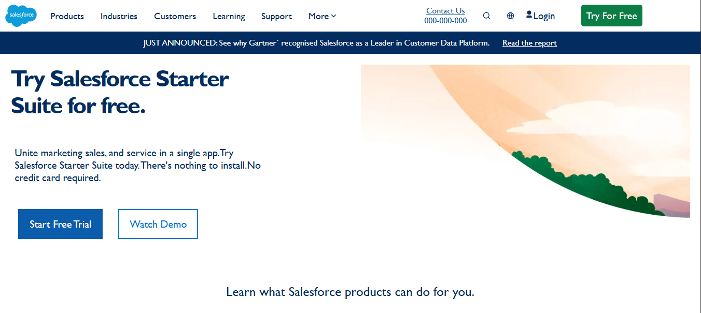

# Salesforce Landing Page ui

This project is a frontend clone of the Salesforce landing page.
It is built to practice HTML, CSS, and layout structuring using Flexbox.

The goal of this project is to improve UI development skills by recreating a real-world website design.

## What I Learned
- Building a landing page layout
- Using Flexbox for alignment
- Styling buttons and sections
- Creating responsive structure

## Features
- Fixed navigation header
- Navigation menu with hover effects
- Login and "Try For Free" button
- Hero section with:
    - Headline and description
    - Call-to-action buttons
    - Image section
- Announcement strip section
- Clean and structured layout

## Preview

## Tech Used
- HTML
- CSS
- Remix Icons