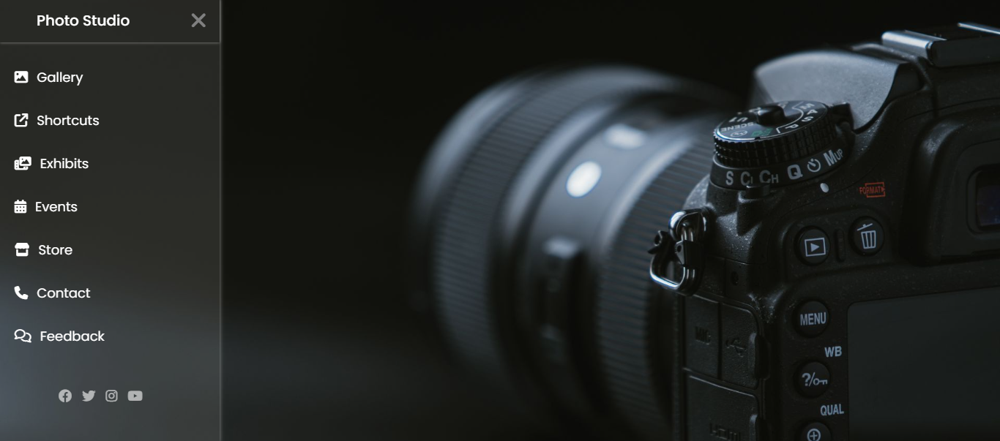

# Photography Sidebar UI (Photo Studio)

## Project Overview

This project is a photography-themed landing UI featuring a modern sidebar navigation menu.
It is built using HTML and CSS, focusing on layout design, animations, and interactive UI without using JavaScript.

The sidebar toggle functionality is implemented using the CSS checkbox hack.

## Tech Stack

* HTML5
* CSS3
* Flexbox
* Font Awesome Icons
* Google Fonts (Poppins)

## Features

* Sidebar navigation menu
* Toggle sidebar using pure CSS (no JavaScript)
* Smooth sliding animation
* Background image layout
* Icon-based menu items
* Hover effects on menu and icons
* Social media icons section

## Preview

## 🎯 What I Learned

* Creating sidebar navigation UI
* Using CSS checkbox hack for interactivity
* Applying transitions and animations
* Working with icons and fonts
* Designing modern UI layouts

