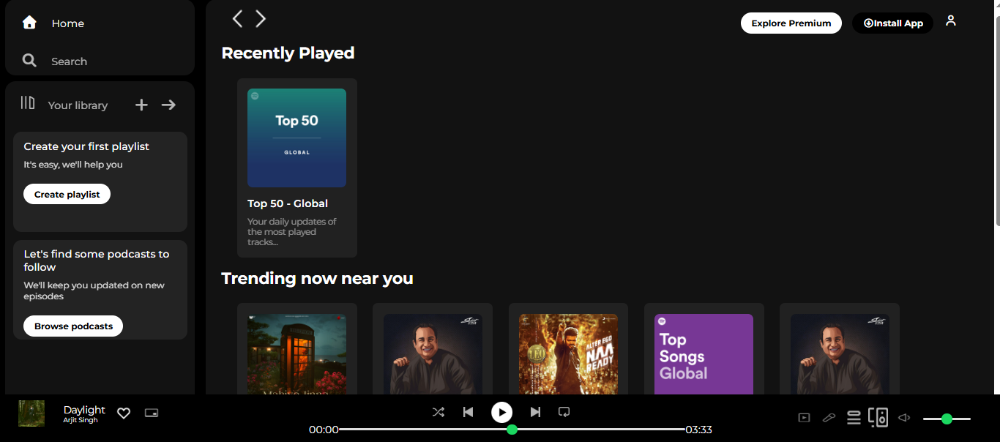

# 🎧 Spotify Web Player UI Clone

This project is a **frontend clone of the Spotify Web Player UI** built using HTML and CSS.
It replicates the layout, design, and user interface of Spotify’s desktop web player.

The goal of this project is to strengthen frontend development skills by recreating a real-world application interface.

## 🚀 Features
* 🎵 Sidebar navigation (Home, Search, Library)
* 📚 Library section with playlist & podcast cards
* 🔝 Sticky top navigation bar
* 🎶 Music player UI (album info, controls, progress bar)
* 🧩 Card-based content sections (Recently Played, Trending, Featured)
* 🎨 Clean dark theme inspired by Spotify
* 💡 Hover effects and smooth UI interactions

## 🛠️ Tech Stack
* HTML5
* CSS3 (Flexbox, Media Queries)
* Font Awesome Icons
* Google Fonts (Montserrat)

## 📸 Preview

## 🎯 What I Learned
* Building complex layouts using Flexbox
* Creating reusable UI components (cards, buttons)
* Designing sticky navigation bars
* Structuring large UI projects
* Styling custom range sliders (music player)
* Improving UI/UX with hover and spacing

## ⚡ Future Improvements
* 📱 Make the UI fully responsive
* 🎧 Add music functionality using JavaScript
* 🔄 Add animations and transitions
* ⚛️ Convert project to React
