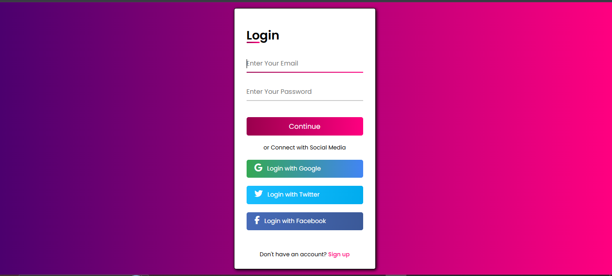

# Modern Login UI

A clean and responsive authentication interface built using HTML and CSS, featuring a modern pink gradient theme. The project focuses on creating a visually appealing and user-friendly form layout suitable for web applications.

---

## Overview

This project presents a minimal and structured login/signup user interface with attention to layout, styling, and usability. It demonstrates core front-end design principles including spacing, alignment, and visual hierarchy.

---

## Preview

<p align="center">
  
</p>

---

## Features

* Gradient-based modern UI design
* Structured form layout with email and password fields
* Custom input focus styling
* Hover effects for interactive elements
* Responsive and centered layout
* Use of pseudo-elements for decorative styling

---

## Technologies Used

* HTML5
* CSS3 (Grid / Flexbox)
* Google Fonts (Poppins)

---

## Styling Highlights

* Gradient Background:

  ```css
  background: linear-gradient(to right, #99004D, #ff0080);
  ```

* Custom underline using `::before` pseudo-element

* Consistent spacing and alignment

* Clean typography with Poppins font

---


## Future Enhancements

* Form validation using JavaScript
* Backend integration 
* Social authentication options
* Accessibility improvements
* Theme customization support
